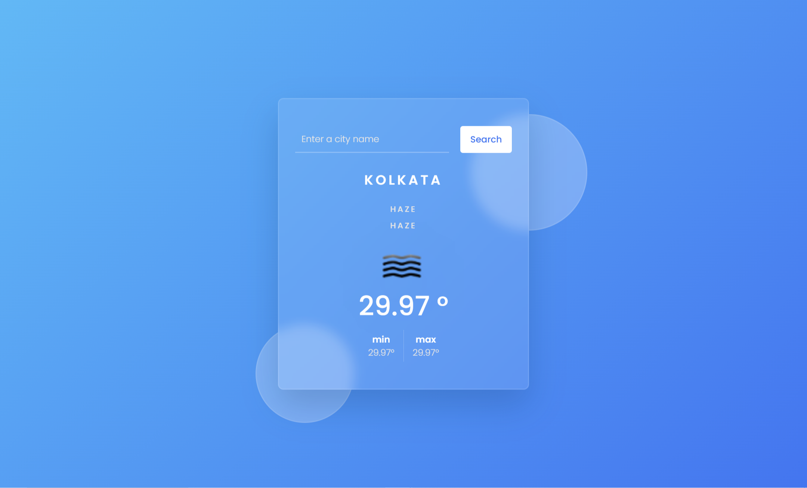

# WeatherForecast 🌤️


## Table of Contents
- [Introduction](#introduction)
- [Features](#features)
- [Demo](#demo)
  - [Screenshot](#screenshot)
  - [GIF Demo](#gif-demo)
- [Technologies Used](#technologies-used)
- [Installation](#installation)
  - [Prerequisites](#prerequisites)
  - [Steps](#steps)
- [Usage](#usage)
- [Contributing](#contributing)
- [License](#license)
- [Contact](#contact)

## Introduction

Welcome to **WeatherForecast**, a user-friendly web application that provides accurate and real-time weather updates for any location worldwide. Whether you're planning your day, a trip, or just curious about the weather, WeatherForecast has got you covered!

## Features

- **Real-Time Data:** Fetches current weather data using reliable APIs.
- **Search Functionality:** Easily search for weather information by city name.
- **Responsive Design:** Optimized for desktops, tablets, and mobile devices.
- **Weather Icons:** Visual representation of weather conditions.
- **Forecast Details:** Includes temperature, humidity, wind speed, and more.

## Demo

### Screenshot



*Screenshot of the WeatherForecast application's homepage.*

### GIF Demo


*Animated demonstration of the WeatherForecast application.*

## Technologies Used

- **Frontend:** HTML, CSS, JavaScript
- **APIs:** OpenWeatherMap API
- **Version Control:** Git & GitHub
- **Deployment:** [GitHub Pages](https://pages.github.com/) / [Netlify](https://www.netlify.com/) *(if applicable)*

## Installation

### Prerequisites

- **Node.js** and **npm** installed on your machine.
- **Git** installed on your machine.

### Steps

1. **Clone the Repository**

   ```bash
   git clone https://github.com/Niranjan-Kumar-Singh/WeatherForecast.git
   ```

2. **Navigate to the Project Directory**

   ```bash
   cd WeatherForecast
   ```

3. **Install Dependencies**

   ```bash
   npm install
   ```

4. **Obtain API Key**

   - Sign up at [OpenWeatherMap](https://openweathermap.org/) to get your free API key.
   - Create a `.env` file in the root directory and add your API key:

     ```env
     REACT_APP_WEATHER_API_KEY=your_api_key_here
     ```

5. **Run the Application**

   ```bash
   npm start
   ```

   The application will run on `http://localhost:3000`.

## Usage

1. **Search for a City**

   - Enter the name of the city in the search bar.
   - Press Enter or click the search icon.

2. **View Weather Details**

   - Current temperature, weather conditions, humidity, wind speed, and more will be displayed.
   - Icons representing the current weather will be shown for better visualization.

3. **Responsive Design**

   - Access the application from any device, and it will adjust its layout accordingly.

## Contributing

Contributions are welcome! Follow these steps to contribute:

1. **Fork the Repository**

2. **Create a New Branch**

   ```bash
   git checkout -b feature/YourFeatureName
   ```

3. **Make Your Changes**

4. **Commit Your Changes**

   ```bash
   git commit -m "Add some feature"
   ```

5. **Push to the Branch**

   ```bash
   git push origin feature/YourFeatureName
   ```

6. **Open a Pull Request**

Please ensure your code follows the project's coding standards and include relevant tests.

## License

This project is licensed under the [MIT License](LICENSE).

## Contact

- **Niranjan Kumar Singh**
- **Email:** niranjan@example.com
- **GitHub:** [Niranjan-Kumar-Singh](https://github.com/Niranjan-Kumar-Singh)
- **LinkedIn:** [Your LinkedIn](https://www.linkedin.com/in/yourprofile)

---

## 📋 Detailed Breakdown

### 1. **Project Title and Badges**
- **Title:** Clearly states the project name.
- **Badges:** Display important information like license, stars, and forks to provide quick insights.

### 2. **Table of Contents**
- Helps users navigate the README easily.

### 3. **Introduction**
- Provides a brief overview of what the project does and its purpose.

### 4. **Features**
- Lists key functionalities to highlight what the project offers.

### 5. **Demo**
- **Screenshot:** Visual representation of the application's homepage.
- **GIF Demo:** Animated demonstration showcasing the application's functionality.

### 6. **Technologies Used**
- Specifies the tools, languages, and platforms used in the project.

### 7. **Installation**
- **Prerequisites:** Lists the necessary tools and software required.
- **Steps:** Step-by-step instructions to set up the project locally, including cloning the repository, installing dependencies, obtaining API keys, and running the application.

### 8. **Usage**
- Guides users on how to use the application effectively.

### 9. **Contributing**
- Encourages others to contribute by outlining the contribution process.

### 10. **License**
- Clearly states the licensing to inform users of their rights regarding the project.

### 11. **Contact**
- Provides ways for users to reach out for support or inquiries.

---

## 🛠️ Additional Tips for Screenshots

1. **Optimize Image Size:**
   - Ensure that your screenshot is optimized for web to reduce load times. Tools like [TinyPNG](https://tinypng.com/) can help compress images without significant quality loss.

2. **Use High-Resolution Images:**
   - While optimizing is important, make sure the screenshot remains clear and legible, especially on high-resolution displays.

3. **Highlight Key Areas:**
   - Use annotations or highlights to draw attention to important features or sections in the screenshot.

4. **Consistent Styling:**
   - Maintain a consistent style across all images and screenshots to give your README a professional look.

5. **Alternative Text:**
   - Always include descriptive alt text for your images to improve accessibility.

   ```markdown
   
   ```

---

## 🎉 Final Thoughts

Including screenshots in your README enhances its visual appeal and provides immediate insight into what your application looks like. By following the structure above, your README will serve as a powerful tool to communicate the value and functionality of your WeatherForecast repository to anyone who visits it.

Feel free to customize this template further to better fit your project's specifics. If you need more assistance or have additional questions about customizing your README, don't hesitate to ask!
